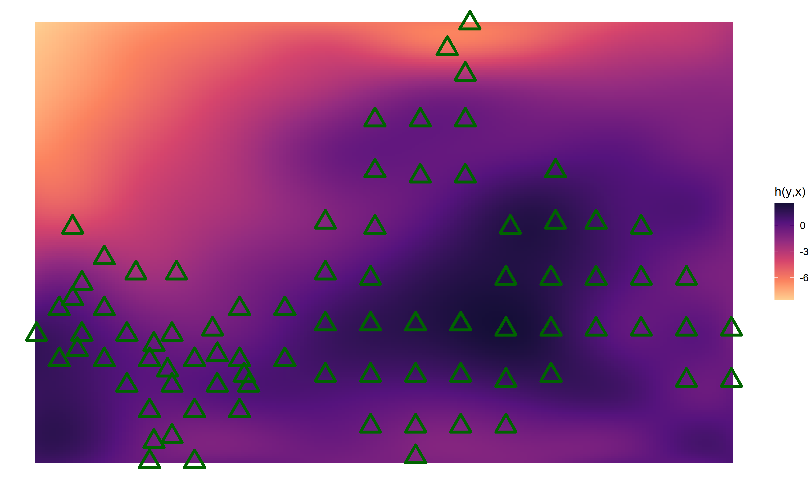
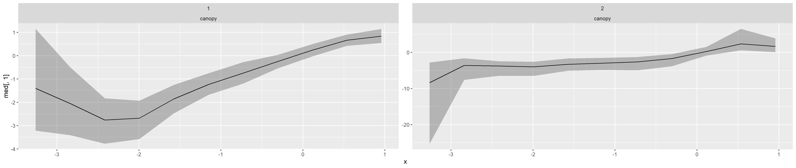

# Complete code for the application
Bayesian discrete conditional transformation models (BDCTMs) provide an overarching model framework for situations where e.g. count hurdle or (non-)proportional odds models with nonlinear (interaction) effects is due. Inference via MCMC is based on the No-U-Turn sampler.
##  [Patent citationsl](patent)
**Nonlinear transformation model of patent citation counts with possibly nonlinear hurdle effects at zero.**

-nonlinear conditional count transformation model with nonlinear hurdle effects

---

##  [Forest](forest)
**Nonlinear partial proportional odds model on forest defoliation categories with random and spatial effect**

- spatial tensor spline

- nonlinear non-proportional odds

---
